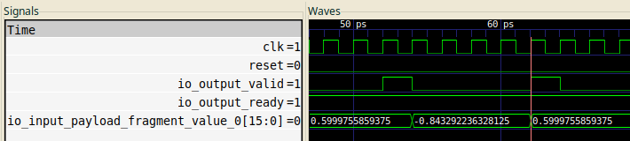

# SetVCD
Programmatically inspect hardware VCD signals using a high-level functional interface.

Higher-order programming constructs and set operations are a natural fit for inspecting VCD signals, and this Python library allows you to easily specify, in text, what simulation timesteps matter to functional correctness.

## Motivating Example
Say you are debugging a streaming interface, you often only care about the values of the data at timesteps meeting the following condition:

$\text{Rising edge} \land \text{Reset is 0} \land \text{ready} \land \text{valid}$



You can filter through an individual signal with a filter function of this signature:

$(\text{Bits}, \text{Bits}, \text{Bits}) \rightarrow \text{Bool}$

with the left-hand tuple representing *values* at timestep $t$: $(t-1, t, t+1)$.

We then define our `get` method, which takes the name of the signal (as a String), a function with the above signature, and returns a set of *timesteps*:

$\texttt{get}: (\text{String}, ((\text{Bits}, \text{Bits}, \text{Bits}) \rightarrow \text{Bool})) \rightarrow \text{Set(Timestep)}$

As what is returned is a set, you can then use [set operations](https://en.wikipedia.org/wiki/Set_(mathematics)#Basic_operations) to manipulate them as needed, and finally extract the values from your desired signal using our `get_value` function:

$\texttt{get-value}: (\text{String}, \text{Set(Timestep)}) \rightarrow \text{List((Timestep, Bits))}$

You can see how this works in our [pre-filled notebook: example.ipynb](example.ipynb)

## Overview

SetVCD is a Python package for analyzing Verilog VCD files and extracting time points where specific signal conditions are met. It provides a simple, type-safe interface for working with simulation waveforms using set-based operations.

## Installation
The package is available in PyPI:
```bash
pip install setVCD
```


## Usage
### Initialization

You can initialize SetVCD with either a filename or a vcdvcd object:

```python
import setVCD
from pathlib import Path

# From string filename
sv = SetVCD("simulation.vcd", clock="clk")

# From Path object
sv = SetVCD(Path("simulation.vcd"), clock="clk")

# From vcdvcd object
import vcdvcd
vcd = vcdvcd.VCDVCD("simulation.vcd")
sv = SetVCD(vcd, clock="clk")
```

The `clock` parameter must be the exact name of the clock signal in your VCD file (case-sensitive). This signal determines the time range for queries.

### Signal Conditions

The `signal_condition` callback receives three arguments representing the signal value at three consecutive time points:

- `sm1`: Signal value at time-1 (None at time 0 or if value is x/z)
- `s`: Signal value at current time (None if value is x/z)
- `sp1`: Signal value at time+1 (None at last time or if value is x/z)

Signal values are `Optional[int]`:
- Integers: Binary values converted to decimal (e.g., "1010" → 10)
- None: Represents x/z values or boundary conditions (t-1 at time 0, t+1 at last time)

The callback should return `True` to include that time point in the result set.

### Examples

#### Basic Signal Detection

```python
# Rising edge: 0 -> 1 transition
rising = sv.get("clk", lambda sm1, s, sp1: sm1 == 0 and s == 1)

# Falling edge: 1 -> 0 transition
falling = sv.get("clk", lambda sm1, s, sp1: sm1 == 1 and s == 0)

# Any edge: value changed
edges = sv.get("data", lambda sm1, s, sp1: sm1 is not None and sm1 != s)

# Level high
high = sv.get("enable", lambda sm1, s, sp1: s == 1)

# Level low
low = sv.get("reset", lambda sm1, s, sp1: s == 0)
```

#### Multi-bit Signals

```python
# Specific pattern on a bus (binary "1010" = decimal 10)
pattern = sv.get("bus[3:0]", lambda sm1, s, sp1: s == 10)

# Bus is non-zero
active = sv.get("data[7:0]", lambda sm1, s, sp1: s != 0)

# Bus transition detection
bus_changed = sv.get("addr[15:0]", lambda sm1, s, sp1: sm1 is not None and sm1 != s)
```

#### Complex Queries with Set Operations

```python
# Rising clock edges when enable is high
clk_rising = sv.get("clk", lambda sm1, s, sp1: sm1 == 0 and s == 1)
enable_high = sv.get("enable", lambda sm1, s, sp1: s == 1)
valid_clocks = clk_rising & enable_high

# Data changes while not in reset
data_changes = sv.get("data", lambda sm1, s, sp1: sm1 is not None and sm1 != s)
not_reset = sv.get("reset", lambda sm1, s, sp1: s == 0)
valid_changes = data_changes & not_reset

# Either signal is high
sig1_high = sv.get("sig1", lambda sm1, s, sp1: s == 1)
sig2_high = sv.get("sig2", lambda sm1, s, sp1: s == 1)
either_high = sig1_high | sig2_high

# Exclusive high (one but not both)
exclusive_high = sig1_high ^ sig2_high
```

#### Advanced Pattern Detection

```python
# Detect setup violation: data changes right before clock edge
data_change = sv.get("data", lambda sm1, s, sp1: sm1 is not None and sm1 != s)
clk_about_to_rise = sv.get("clk", lambda sm1, s, sp1: s == 0 and sp1 == 1)
setup_violations = data_change & clk_about_to_rise

# Handshake protocol: valid and ready both high
valid_high = sv.get("valid", lambda sm1, s, sp1: s == 1)
ready_high = sv.get("ready", lambda sm1, s, sp1: s == 1)
handshake_times = valid_high & ready_high

# State machine transitions (binary "00" = 0, "01" = 1)
state_a = sv.get("state[1:0]", lambda sm1, s, sp1: s == 0)
state_b = sv.get("state[1:0]", lambda sm1, s, sp1: s == 1)
# Times when transitioning from state A to state B
transition = sv.get("state[1:0]", lambda sm1, s, sp1: sm1 == 0 and s == 1)
```

## Value Types

SetVCD supports three ValueType options to control how signal values are converted before being passed to your condition lambdas:

### Raw() - Integer Conversion (Default)

Converts binary strings to decimal integers. X/Z values become `None`. This is the default behavior.

```python
from setVCD import SetVCD, Raw

sv = SetVCD("simulation.vcd", clock="clk")

# Default behavior (Raw is implicit)
rising = sv.get("data[7:0]", lambda sm1, s, sp1: sm1 is not None and sm1 < s)

# Explicit Raw (same as above)
rising = sv.get("data[7:0]", lambda sm1, s, sp1: sm1 is not None and sm1 < s, value_type=Raw())

# Multi-bit signals converted to decimal
# Binary "00001010" → integer 10
high_values = sv.get("bus[7:0]", lambda sm1, s, sp1: s is not None and s > 128)
```

### String() - Preserve Raw Strings

Keeps vcdvcd's raw string representation, including X/Z values as literal strings. Useful for detecting unknown states.

```python
from setVCD import SetVCD, String

sv = SetVCD("simulation.vcd", clock="clk")

# Detect X/Z values in data bus
has_x = sv.get("data[7:0]",
               lambda sm1, s, sp1: s is not None and 'x' in s.lower(),
               value_type=String())

# String pattern matching
all_ones = sv.get("bus[3:0]",
                  lambda sm1, s, sp1: s == "1111",
                  value_type=String())

# Get string values
values = sv.get_values("data", timesteps, value_type=String())
# Returns: [(50, "1010"), (60, "1111"), (70, "xxxx"), ...]
```

**X/Z Handling:** X and Z values are preserved as strings (`"x"`, `"z"`, `"xxxx"`, etc.)

### FP() - Fixed-Point to Float

Converts binary strings to floating-point by interpreting them as fixed-point numbers with configurable fractional bits and optional sign bit.

```python
from setVCD import SetVCD, FP

sv = SetVCD("simulation.vcd", clock="clk")

# Temperature sensor with 8 fractional bits (Q8.8 format)
# Binary "0001100100000000" → 25.0 degrees
above_threshold = sv.get("temp_sensor[15:0]",
                        lambda sm1, s, sp1: s is not None and s > 25.5,
                        value_type=FP(frac=8, signed=False))

# Signed fixed-point (Q3.4 format - 1 sign bit, 3 integer bits, 4 fractional bits)
# Binary "11111110" → -0.125 (two's complement)
negative_values = sv.get("signed_value[7:0]",
                        lambda sm1, s, sp1: s is not None and s < 0,
                        value_type=FP(frac=4, signed=True))

# Get fixed-point values
voltages = sv.get_values("adc_reading[11:0]", timesteps,
                        value_type=FP(frac=12, signed=False))
# Returns: [(50, 1.2), (60, 2.5), (70, 3.8), ...]
```

**X/Z Handling:** X and Z values become `float('nan')`. Use `math.isnan()` to detect them:

```python
import math

# Filter out NaN values
valid_readings = sv.get("sensor",
                       lambda sm1, s, sp1: s is not None and not math.isnan(s),
                       value_type=FP(frac=8, signed=False))
```

**Fixed-Point Formula:**
- Unsigned: `value = int_value / (2^frac)`
- Signed: Two's complement, then divide by `2^frac`

**Examples:**
- `"00001010"` with `frac=4, signed=False` → `10 / 16 = 0.625`
- `"11111110"` with `frac=4, signed=True` → `-2 / 16 = -0.125`
- `"00010000"` with `frac=0, signed=False` → `16 / 1 = 16.0` (integer)

### Hardware Use Cases

**Raw (Default):** Most general-purpose verification - state machines, counters, addresses, data comparisons

**String:** Debugging X/Z propagation, detecting uninitialized signals, bit-pattern analysis

**FP:** Analog interfaces (ADC/DAC), sensor data, fixed-point DSP verification, power/temperature monitors

## Future Enhancements

Planned for future versions:

- Higher-order operations for signal conditions
- Performance optimization for large VCD files
- Streaming interface for very large files
- MCP (Model Context Protocol) integration
