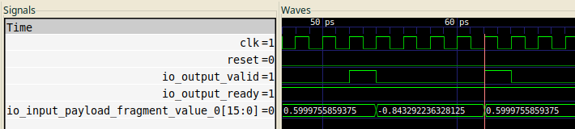

# SetVCD
Programmatically inspect hardware VCD signals using a high-level functional interface.

Higher-order programming constructs and set operations are a natural fit for inspecting VCD signals, and this Python library allows you to easily specify, in text, what simulation timesteps matter to functional correctness.

## Motivating Example
Say you are debugging a streaming input interface (`Accelerator.io_input`) and you would like to extract only the values when the streaming transaction is valid. Typically when viewing a wavefile in a viewer, the points we care about look like this:


We can write this desired condition, parameterised by simulation timestep `t` as a formal statement:
```python
(clk(t - 1) == 0 and clk(t) == 1) and
reset(t) == 0 and
input_ready(t) == 1 and
input_valid(t) == 1
```
This is a very natural fit for [higher-order functions](https://en.wikipedia.org/wiki/Higher-order_function) and [set operations](https://en.wikipedia.org/wiki/Set_(mathematics)#Basic_operations).

This library provides you two important methods:
- Get set of timesteps with condition:
   ```python
    SetVCD.get(signal_name: String,
               condition: (ValueType, ValueType, ValueType) -> Bool,
               value_type: Raw or String or FP)
               -> SignalExpression
   ```
   - SignalExpression represents subset of timesteps of the wavefile that meet the provided condition.
   - Two SignalExpression objects (`a` and `b`) be combined with set operations to create a higher SignalExpression
     - `c = a & b`: c is the intersection of set a and b.
     - `c = a | b`: c is the union of set a and b.
     - `c = a ^ b`: c is the difference of set a and b.

- A SignalExpression object obtained from `get` and combined with operations can then be evaluated on the wavefile via:
  ```python
  SetVCD.get_value(signal_name: str,
                   expr: SignalExpression,
                   value_type: Raw or String or FP)
                   -> List(Value)
  SetVCD.get_value_with_t(signal_name: str,
                   expr: SignalExpression,
                   value_type: Raw or String or FP)
                   -> List((Timestep, Value))
  ```
  - This yields the set of values you would be interested in.

For a practical example, please see our [pre-filled notebook: example.ipynb](example.ipynb)

## Overview

SetVCD is a Python package for analyzing Verilog VCD files and extracting time points where specific signal conditions are met. It provides a simple, type-safe interface for working with simulation waveforms using set-based operations.

## Installation
The package is available in PyPI:
```bash
pip install setVCD
```
## Future Enhancements

Planned for future versions:
- Higher-order operations for signal conditions
- Performance optimization for large VCD files
- Streaming interface for very large files
- MCP (Model Context Protocol) integration
